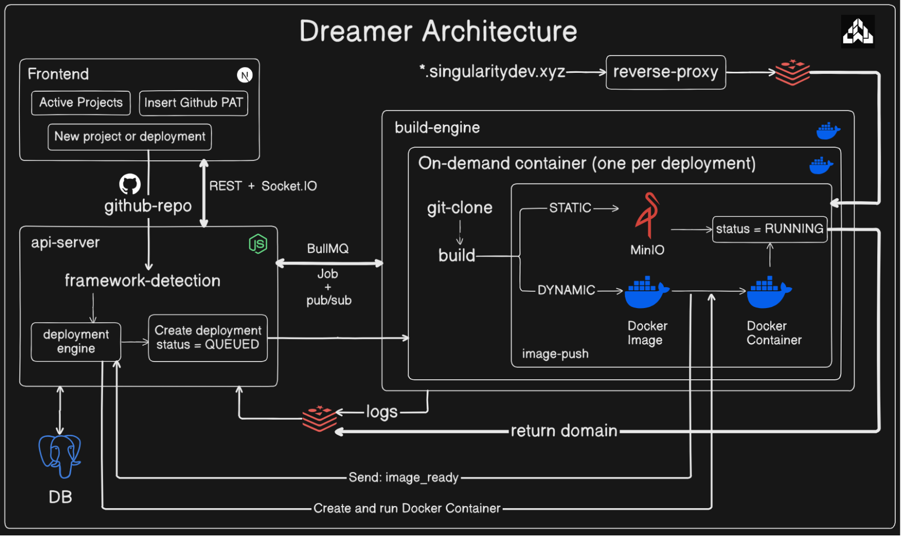

<div align="center">

<br />

```
██████╗ ██████╗ ███████╗ █████╗ ███╗   ███╗███████╗██████╗
██╔══██╗██╔══██╗██╔════╝██╔══██╗████╗ ████║██╔════╝██╔══██╗
██║  ██║██████╔╝█████╗  ███████║██╔████╔██║█████╗  ██████╔╝
██║  ██║██╔══██╗██╔══╝  ██╔══██║██║╚██╔╝██║██╔══╝  ██╔══██╗
██████╔╝██║  ██║███████╗██║  ██║██║ ╚═╝ ██║███████╗██║  ██║
╚═════╝ ╚═╝  ╚═╝╚══════╝╚═╝  ╚═╝╚═╝     ╚═╝╚══════╝╚═╝  ╚═╝
```
<p align="center">
  
</p>

**A self-hosted PaaS that deploys any GitHub repo in under 3 minutes.**  
Static sites, SSR apps, and Node servers — on your own machine.

<br />

[](LICENSE)
<picture><source media="(prefers-color-scheme: dark)" srcset="https://shieldcn.dev/npm/node/node.svg?variant=outline&amp;theme=green&amp;logo=nodedotjs&amp;label=Node.js&amp;mode=dark"></picture>
[](https://typescriptlang.org)
[](https://postgresql.org)
[](https://redis.io)

<br />

[**Walkthrough Video**](https://drive.google.com/file/d/1jHGQnt4hf-lu4mkSWboDuhPpi8_1WSUw/view?usp=sharing) · [**Live Link**](https://dreamer.samanp.xyz) · [**Architecture Docs**](#architecture) · [**Self-Host Guide**](docs/SELF-HOSTING.md) · [**Recruiter?**](#recruiter)

<br />

</div>

---

## What Is This

Dreamer is a deployment platform I built from scratch to understand how Vercel and Railway work under the hood. It accepts a GitHub repository URL and handles everything else: cloning, framework detection, building, containerizing (for dynamic apps), uploading (for static apps), subdomain routing, real-time log streaming, and scale-to-zero for idle services.

This is not a tutorial project with renamed variables. It handles the problems that tutorials skip: state machine enforcement at the database level, thundering-herd prevention on container wake-up, per-deployment host-based routing for dynamic apps, encrypted secret storage with audit logging, and JWT refresh token rotation.

---

## Architecture



#### Explained in more detail in [docs](https://dreamer.samanp.xyz/docs)

**Mermaid Diagram:**
```
                        ┌─────────────────────────────────────────────┐
                        │              User Request                    │
                        │         *.dreamer.yourdomain.com             │
                        └─────────────────────┬───────────────────────┘
                                              │
                                    ┌─────────▼──────────┐
                                    │   Reverse Proxy     │
                                    │  (Wake-Up Proxy)    │
                                    │                     │
                                    │ Redis lookup:       │
                                    │ containerState:{id} │
                                    └──┬──────────────┬───┘
                                       │              │
                              RUNNING  │              │  SLEEPING
                                       │              │
                     ┌─────────────────▼──┐   ┌──────▼───────────────────┐
                     │   Static Site      │   │   Wake-Up Handler         │
                     │   (MinIO stream)   │   │                           │
                     │                   │   │  Browser → loading page   │
                     │   or              │   │  API client → 503 +       │
                     │   Dynamic App     │   │  Retry-After: 30          │
                     │   (app            │   │                           │
                     │    container)     │   │  BullMQ wake job queued   │
                     └───────────────────┘   │  (SET NX — only one job   │
                                             │   fires for N requests)   │
                                             └──────────────────────────┘


  Deploy Flow:

  POST /projects/:id/deploy
           │
           ▼
  ┌─────────────────┐     ┌──────────────────────────────────────────────────────────┐
  │  API Server     │────▶│  BullMQ Queue  (Redis)                                   │
  │  (Express)      │     │                                                          │
  │                 │     │  concurrency: 3  ─── max 3     builds simultaneously     │
  │  202 Accepted   │     │  attempts: 3     ─── exponential backoff on failure      │
  │  in < 5ms       │     │  limiter: 10/min ─── platform-wide rate cap             │
  └─────────────────┘     └──────────────────────┬───────────────────────────────────┘
                                                 │
                                       ┌─────────▼──────────┐
                                       │   Build Worker      │
                                       │                     │
                                       │  ExecutionEngine    │
                                       │  .build(job)        │
                                       └─────────┬───────────┘
                                                 │
                             ┌───────────────────┼──────────────────────┐
                             │                   │                      │
                    Framework Detection          │                      │
                             │                   │                      │
                    ┌────────▼──────┐   ┌────────▼───────┐   ┌─────────▼──────┐
                    │    STATIC     │   │  NEXT.JS SSR   │   │  NODE / EXPRESS │
                    │               │   │                │   │                 │
                    │  docker run   │   │  docker run    │   │  docker run     │
                    │  build-engine │   │  build-engine  │   │  build-engine   │
                    │ → npm build   │   │ → npm build    │   │ → npm build     │
                    │ → upload      │   │ → docker build │   │ → docker build  │
                    │   dist/ to    │   │ → run image as │   │ → run image as  │
                    │   MinIO       │   │   container on │   │   container on  │
                    │ {slug}.domain │   │   dreamer-local│   │   dreamer-local │
                    │ → reverse-    │   │ {slug}.domain  │   │ {slug}.domain   │
                    │   proxy       │   │ → nginx →      │   │ → nginx →       │
                    │   streams     │   │   reverse-proxy│   │   reverse-proxy │
                    └───────────────┘   └────────────────┘   └─────────────────┘
                                                 │
                                       ┌─────────▼──────────────────────────────┐
                                       │         Log Pipeline                    │
                                       │                                         │
                                       │  build-engine → Redis pub/sub          │
                                       │  → API Server → Socket.IO → browser    │
                                       │  → PostgreSQL (durable, searchable)    │
                                       └─────────────────────────────────────────┘


  Scale-to-Zero (Dynamic Apps):

  ┌─────────────────┐    60s poll    ┌──────────────────────────────┐
  │  Idle Detector  │───────────────▶│  SELECT * FROM Deployment    │
  │  (BullMQ job)   │                │  WHERE status = 'RUNNING'    │
  │                 │                │  AND type = 'DYNAMIC'        │
  │                 │                │  AND lastRequestAt < now()-15m│
  └────────┬────────┘                └──────────────────────────────┘
           │
           ▼
  ┌─────────────────┐
  │  Sleep Worker   │──▶ SET containerState:{id} = sleeping  (Redis)
  │                 │──▶     docker stop the app container
  │                 │──▶ DB status → SLEEPING
  └─────────────────┘

  On next request:
  Reverse proxy → Redis key = sleeping → serve wake page
                                       → BullMQ wake job (SET NX — dedup)
                                       →     docker run container again
                                       → poll until health check passes
                                       → SET containerState:{id} = running
                                       → all queued requests unblocked
```

---

## Stack

| Layer | Technology | Why |
|---|---|---|
| **API Server** | Node.js, Express 5, TypeScript | Familiar, fast to iterate, typed end to end with Zod validation |
| **Queue** | BullMQ + Redis | Persistent jobs, retry logic, concurrency limiting |
| **Database** | PostgreSQL 16 + Prisma | State machine triggers enforced at DB layer, JSONB for metadata, tsvector for log search |
| **Build Runner** | build-engine container (`docker run` per build) | Isolated per-build environment, no shared state — the worker shells out through the host Docker socket |
| **Dynamic App Runtime** | Sibling Docker containers on a private compose network | Persistent containers, health-checked staged swaps on redeploy, no orchestration daemon needed |
| **Static Hosting** | MinIO (S3-compatible) + reverse-proxy streaming | Self-hosted object storage for build output, no running container at rest |
| **Edge Routing** | nginx (wildcard `*.domain`) + certbot TLS | Host-based routing to deployed apps, HTTPS via Let's Encrypt |
| **Container Images** | Locally built images (`docker build`, tagged per project) | No external registry — build-engine tags `dreamer-app:<slug>` and runs it directly |
| **Cache / PubSub** | Redis ×2 (ioredis) — platform + build events | Log streaming, container state, rate limiting; a second instance isolates noisy build pub/sub |
| **Frontend** | Next.js, React 19, Tailwind CSS v4 | Server components for data-heavy pages, Socket.IO client for live updates |
| **Realtime** | Socket.IO (WebSocket) | Live build logs and deployment-state changes pushed from API server to dashboard |
| **Auth** | JWT (15min access) + httpOnly refresh cookie | XSS-resistant, token rotation, session revocation |
| **Secrets** | AES-256-GCM per-value encryption | Secrets never stored in plaintext, IV per value |

---

## Features

### Deployment Engine

- **Auto-detects framework** from `package.json` — React (CRA/Vite), Vue, Svelte, Next.js (static export vs SSR), Express, Fastify, plain HTML. No config file required.
- **Two infrastructure paths** based on detection:
  - Static apps → uploaded to MinIO, streamed by the reverse proxy. No running container at rest.
  - Dynamic apps → a long-lived Docker container on the private compose network, routed by hostname through nginx → reverse-proxy.
- **Generates a Dockerfile** for dynamic apps that don't provide one. Multi-stage builds for Next.js SSR (builder → runner, ~200MB final image). Single-stage for Express.
- **Environment variable injection** — secrets stored AES-256-GCM encrypted in Postgres, decrypted at deploy time and injected as build-container environment variables. Build snapshots capture which secrets were active at deploy time, enabling accurate rollback.
- **Rollback** — re-queues any previous deployment with its original commit hash and env snapshot. One click in the dashboard.

### Real-Time Observability

- **Live build logs** stream from the build container → Redis pub/sub → Socket.IO → browser as they happen, with sequence numbers for correct ordering and gapless replay.
- **Dual delivery**: Redis pub/sub for < 100ms latency while the build is active; PostgreSQL as durable storage for replay after the fact. If you refresh mid-build, logs replay from the DB with no gaps.
- **State timeline** on every deployment — shows exactly how long was spent queued, building, uploading, and starting, with timestamps on each transition. Pulled from an append-only `DeploymentStateTransition` table.
- **Full-text search** across build logs via PostgreSQL `tsvector` index. Find every deployment where `MODULE_NOT_FOUND` appeared without scanning rows.

### Scale-to-Zero

Dynamic app deployments that receive no traffic for 15 minutes are automatically stopped — no running container, no idle resource usage. On the next inbound request:

- The reverse proxy checks `containerState:{id}` in Redis (single microsecond lookup)
- Browser clients receive an HTML loading page with 3-second polling — the same UX Railway uses
- API clients (curl, mobile, fetch) receive `503 + Retry-After: 30`
- A BullMQ wake job is enqueued using `SET NX` — regardless of how many concurrent requests arrive, exactly one wake job fires
- The platform re-runs the container, the proxy polls until the health check passes, then all buffered requests go through normally

Container cold start depends on image size. Smaller images (alpine base, multi-stage build) are prioritized.

### Platform

- **BullMQ queue** between HTTP handler and build dispatch — `/deploy` returns `202 Accepted` in under 5ms, never blocks. Configurable concurrency (default: 3 simultaneous builds) and rate limit (default: 10 builds/minute platform-wide).
- **Bull Board** at `/admin/queues` — live dashboard showing pending, active, completed, and failed build jobs. Useful for debugging stuck deployments.
- **GitHub webhook auto-deploy** — HMAC-verified, delivery logged, duplicate-deployment guard (won't queue if a build is already in progress for the same project).
- **Session management** — users can view all active sessions with device, IP, and last-seen time, and revoke any of them individually. Password change invalidates all sessions.
- **Audit log** — every sensitive action (login, env var reveal, project delete, deployment stop) recorded with user ID, IP, and timestamp.
- **Dual execution engine** — `DEPLOYMENT_ENVIRONMENT=cloud` routes to cloud; `DEPLOYMENT_ENVIRONMENT=bare_metal` routes to local Docker + NGINX. Both implement the same `ExecutionEngine` interface; the BullMQ worker has zero knowledge of the environment.

---

## Project Structure

```
dreamer/
├── api-server/           # Express API server + BullMQ build worker (same image, two services)
│   ├── prisma/           # Schema + migrations
│   └── src/workers/      # build.worker.ts — claims jobs, launches build-engine
├── build-engine/         # Per-build container: clone → detect → install/build → upload / docker build
├── reverse-proxy/        # Hostname router: MinIO stream (static) vs app container (dynamic) + metrics
├── frontend/             # Next.js dashboard
├── nginx/templates/      # Edge routing template: *.DOMAIN → reverse-proxy, optional webhook route
├── scripts/              # TLS cert renewal + install helpers
├── docs/                 # Architecture, auth, deployments, framework-detection docs
└── docker-compose.yml    # postgres, redis ×2, minio, api-server, build-worker, frontend, reverse-proxy, nginx
```

---

## Design Decisions

**Why BullMQ instead of a hosted queue service?** BullMQ gives per-job retry configuration, concurrency control, and priority queues on top of a Redis instance this stack already runs — no extra infrastructure, no IAM, no additional failure domain to operate.

**Why Socket.IO instead of raw WebSocket or SSE?** Log streaming is mostly one-directional, but the dashboard also needs reconnection semantics for free: if a laptop sleeps mid-build, Socket.IO auto-reconnects with backoff, and one connection multiplexes both build-log lines and deployment-state events. Raw WebSocket or SSE would mean hand-rolling a reconnect-and-resume layer that Socket.IO already ships.

**Why PostgreSQL tsvector for log search instead of Elasticsearch?** At the scale this platform operates, full-text search via a GIN-indexed `tsvector` column in PostgreSQL handles it fine. Elasticsearch would add operational overhead (another service, another failure mode) for the same query results. If this were indexing millions of deployments, the calculus changes.

**Why AES-256-GCM with a per-value IV instead of a single column-level encryption key?** GCM provides authenticated encryption — if the ciphertext is tampered with, decryption fails with an authentication error rather than producing garbage. Per-value IVs mean that two identical secrets produce different ciphertexts, so an attacker with DB access can't do a dictionary attack by comparing columns.

**Why are state transitions enforced with a Postgres trigger?** Application-layer validation breaks under race conditions: two BullMQ workers processing retry attempts of the same job can both attempt to transition `QUEUED → BUILDING`. A database trigger either succeeds or raises an exception — no in-between. The BullMQ worker catches the exception and treats it as a signal that another worker already claimed the job.

**Why host-based routing through nginx instead of path-based routing?** Host-based routing (`fuzzy-cat-42.dreamer.com`) maps naturally to how users think about their apps. Path-based routing (`dreamer.com/apps/fuzzy-cat-42/`) would require modifying app code to handle the path prefix. A single wildcard listener handing every hostname to the reverse-proxy — which resolves static vs dynamic per request — is more moving parts than a shared path router, but it's the correct UX tradeoff.

---

## What I Learned Building This

The problems that were harder than expected:

**The wake-up proxy thundering herd.** The obvious implementation — check if sleeping, start the container, wait, respond — breaks when 50 requests arrive in a 100ms window. You end up with 50 simultaneous container-start commands and 50 competing pollers. The fix (Redis `SET NX` as a distributed mutex, with all waiting requests sharing one poll loop) took three rewrites to get right.

**Log sequence ordering.** Redis pub/sub delivers messages in order within a connection, but if the connection drops and reconnects, you might miss lines. The sequence number column in `DeploymentLog` means the client can always request "give me everything after sequence N" and get a gapless replay — pub/sub is for latency, the DB is for correctness.

**The static vs dynamic split is not binary.** Next.js with `output: 'export'` in `next.config.js` produces a static site just like Create React App. Next.js without it needs a running Node process. The framework detector has to read the Next.js config (which might be JS, TS, or CJS), not just check for the `next` dependency in package.json.

**Container cold start is the dominant latency source.** Everything else in the wake-up path (Redis lookup, DB query, route lookup) is under 10ms. Starting the container and passing its health check takes seconds, dominated almost entirely by image size: a 50MB alpine-based image is live in ~3s; a 500MB Ubuntu-based image takes 20s+.

---

## Deployment Status Reference

| Status | Description | Next States |
|---|---|---|
| `QUEUED` | Build job created, waiting for a worker | `LAUNCHING`, `CANCELLED`, `FAILED` |
| `BUILDING` | build-engine container running npm install + npm build | `UPLOADING` (static), `STARTING` (dynamic), `FAILED` |
| `UPLOADING` | Syncing dist/ to MinIO | `RUNNING`, `FAILED` |
| `STARTING` | App container started on the compose network, health check pending | `RUNNING`, `FAILED` |
| `RUNNING` | App live and serving requests | `SLEEPING`, `STOPPED`, `FAILED` |
| `SLEEPING` | Container stopped to free resources, wakes on first request | `WAKING`, `STOPPED` |
| `WAKING` | Container starting back up, wake proxy holding requests | `RUNNING`, `FAILED`, `STOPPED` |
| `STOPPED` | Manually stopped or replaced by newer deployment | — |
| `FAILED` | Any step errored — see `errorCode` + `errorMessage` | — |
| `CANCELLED` | Queued but cancelled before worker picked it up | — |

---

## Local Development

```bash
sudo chmod +x ./install.sh
sudo ./install.sh --domain yourdomain.com --cloudflare-token YOUR_CF_TOKEN

sudo docker compose --env-file .env.deploy up -d --build
```

---

## License

MIT — see [LICENSE](LICENSE).

---

# Recruiter
<div align="center">

Built by [Saman Pandey](https://github.com/SamanPandey-in)  
Computer Science, VESIT Mumbai

*If you're reading this as a recruiter: the interesting parts are the scale-to-zero wake-up proxy, the database-level state machine trigger, and the dual execution engine abstraction. <a href="mailto:samanp.work@gmail.com">Send Email</a> to `samanp.work@gmail.com` to get a walkthrough of the actual cloud version.*

</div>
