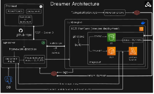

# Architecture Overview

## The system, end to end



Five services. Two of them (`frontend`, `api-server`) are the control
plane — the dashboard you interact with. One (`build-engine`) is
ephemeral compute that only exists for the duration of a single build.
One (`reverse-proxy`) is the always-on ingress every deployed app's
traffic passes through. The last "service" isn't a service at all — it's
whatever a user's own project becomes once deployed: either files in S3
or a Lambda function, both entirely outside Dreamer's own runtime.

## Why a separate build-engine, and why ECS RunTask specifically

Building an arbitrary user's repo means running `npm install` and
`npm run build` for code you didn't write, with a package.json you don't
control, potentially with a malicious `postinstall` script. That's not
something to run inside `api-server`'s own process — a compromised build
should not have access to `api-server`'s database credentials, its
Redis connection, or any other tenant's data.

ECS **RunTask** (not a long-running **Service**) is the specific
mechanism: a single Fargate task per build, with its own isolated
container, its own filesystem, that exits the moment the build finishes.
`api-server` never runs untrusted code itself — it only ever launches an
isolated task and waits for that task to report back over Redis pub/sub.

See [`deployments/overview.md`](../deployments/overview.md) for exactly
what `build-engine` does once it's running.

## Why Postgres + Redis are used for different things

- **Postgres** is the durable source of truth — every `Project`,
  `Deployment`, `User`, `UserSession`, and `DeploymentLog` row lives here.
  Anything that needs to survive a restart, or that another part of the
  system needs to query later, goes here.
- **Redis** is used for two things that are NOT durable state:
  1. **Pub/sub** — `build-engine` publishes log lines and status updates
     to a channel named `deployment:{deploymentId}`; `api-server`
     subscribes and relays them to connected dashboard clients over
     Socket.IO, AND persists them to Postgres as it goes (see
     `realtime/log-relay.ts`). Redis here is a message bus, not storage —
     if no one's subscribed when a message publishes, it's gone; the
     Postgres write is what actually makes the log durable.
  2. **A 30-second cache** in `reverse-proxy`, in front of the Postgres
     query that resolves a subdomain to a deployment (see
     [`reverse-proxy/README.md`](../reverse-proxy/README.md)) — every
     single request to every deployed app would otherwise cost a
     Postgres round trip before it could even start proxying.

## The full lifecycle of one deployment

This is the thread that ties every other doc together. Follow a single
deployment from click to live URL:

1. **User clicks "Deploy"** in the dashboard (or hits `POST
   /api/deployments`). `api-server`'s `deployment.service.ts` creates a
   `Deployment` row with status `QUEUED`, resolves the project's
   configured (or user-overridden) env vars, and calls
   `deploymentEngine.launchBuildTask()`.
2. **`launchBuildTask()`** issues an ECS `RunTask` — one Fargate task,
   running the `build-engine` image, with everything that task needs
   (repo URL, branch, install/build commands, `DEPLOYMENT_TYPE`,
   `FRAMEWORK`, env vars) passed in as container overrides. The
   `Deployment` row transitions to `BUILDING`.
3. **Inside the task**, `build-engine`'s `script.js` clones the repo,
   checks out the right commit, and branches on `DEPLOYMENT_TYPE`:
   - **STATIC**: `npm install` → `npm run build` → verify the output
     directory exists → upload every file to S3 under
     `__outputs/{project-slug}/`.
   - **DYNAMIC**: resolve a Dockerfile (the repo's own, or a generated
     one) → build it with Kaniko (no Docker daemon needed — see
     [`deployments/dynamic-deployments.md`](../deployments/dynamic-deployments.md))
     → push the image to ECR.
   Every log line and status change is published to Redis as it happens.
4. **`api-server`'s `log-relay.ts`** is subscribed to that Redis channel
   the whole time — it persists each log line to Postgres and relays it
   over Socket.IO to anyone with the deployment's detail page open, live.
5. **STATIC finishes here** — the last thing `build-engine` publishes is
   a `RUNNING` status with the deployment's public URL, and
   `Project.activeDeploymentId` is updated to point at it.
   **DYNAMIC has one more hop**: `build-engine`'s job ends at "image
   pushed to ECR" — it publishes an `image_ready` event instead. That
   event triggers `handleImageReady()` back in `api-server`, which calls
   the AWS Lambda APIs directly (`CreateFunction`/`UpdateFunctionCode`,
   a Function URL, the resource policy that makes it public) — this
   happens in `api-server`, not `build-engine`, deliberately: the
   build task's IAM role only ever needed S3/ECR permissions, never
   Lambda permissions. Once the function reports `Active`, `api-server`
   transitions the deployment to `RUNNING` itself.
6. **A visitor hits `https://{project-slug}.yourdomain.com`.**
   `reverse-proxy` looks up that subdomain (Postgres, Redis-cached),
   finds the project's `activeDeploymentId`, checks its `type`, and
   proxies accordingly — straight to the S3 path for STATIC, or to the
   deployment's Lambda Function URL (with the Host header rewritten) for
   DYNAMIC.

Every step above is covered in far more depth in its own doc — this page
is the map, not the territory.

## The state machine

`Deployment.status` isn't a free-form string — a Postgres trigger
(`check_deployment_status_transition`, in the schema's migrations)
enforces which transitions are even possible at the database level, not
just in application code. The full set:

```
QUEUED → BUILDING → UPLOADING* → RUNNING
                  ↘ STARTING†  ↗
                  ↘ FAILED
        (any of the above) → STOPPED
```

\* `UPLOADING` is STATIC-only (the S3 upload phase).
† `STARTING` is DYNAMIC-only — covers the window between "image pushed"
and "Lambda function reports Active."

This matters beyond bookkeeping: it's what makes `stopDeployment()` safe
to call from any state without special-casing every possible current
status in application code — an invalid transition simply gets rejected
by Postgres itself.
